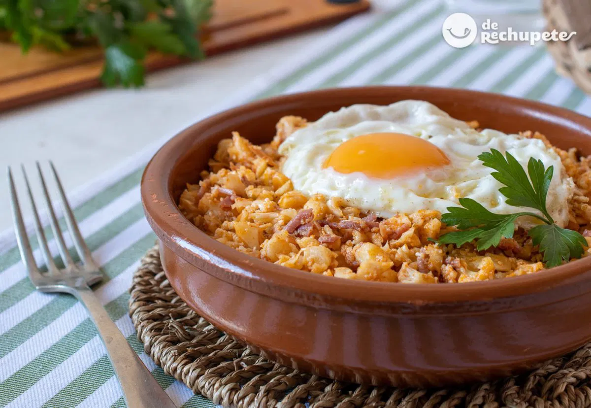

For 1 serving.

1. Wash the cauliflower thoroughly and drain to remove excess water. 
2. Coarsely chop it into approximately 1-centimeter pieces l or less.
3. Heat a layer of extra virgin olive oil in a large pan or skillet. 
4. Sauté a clove of garlic, peeled and finely grated or minced. 
5. Before the garlic begins to brown, add the cauliflower crumbs, salt to taste, and stir. Sauté for 7-8 minutes. 
6. Optionally, add the paprika and stir. 
7. Add the diced serrano ham and sauté over medium heat for a couple of minutes. 
8. Serve the cauliflower crumbs immediately, accompanied by a fried or grilled egg.

---

_Adaptation from [de Rechupete](https://www.abc.es/recetasderechupete/migas-de-coliflor-receta-de-unas-migas-deliciosas-y-mas-saludables-con-coliflor/46658/)._

