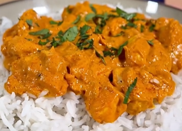

1. Cook the rice.
2. Cut the chicken breast into pieces and sauté with salt and pepper.
3. Add the cream cheese, Greek yogurt, and a bit of tomato paste, and mix well.
4. Add sweet or spicy paprika, garlic and onion powder, a generous amount of curry, a pinch of cumin, and food coloring (optional).
5. Mix until it reduces slightly.

---

_From [Instagram @ugar90](https://www.instagram.com/reel/C0yqhV9qyYX/?utm_source=ig_web_copy_link&igsh=MzRlODBiNWFlZA==)._

