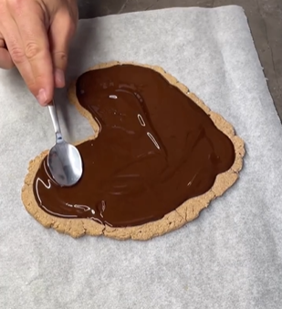

1. Mix the ground oats with the yogurt using a whisk or blender.
2. Spread the mixture on parchment paper, shaping it into a hearth.
3. Bake for 12 minutes at 180°C (356°F), flipping once halfway through.
4. Melt the chocolate or cocoa powder and cover the pastry.
5. Let it cool and then refrigerate in the fridge.

---

_From [Instagram @fitfoodmania](https://www.instagram.com/reel/Crq7IehIx_h/?utm_source=ig_web_copy_link&igsh=MzRlODBiNWFlZA==)._

