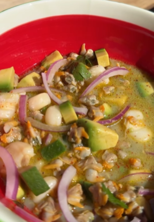

You can substitute the can of cockles with a can of clams.

1. Put the contents of the can of cockles in a glass jar, including the liquid.
2. Cut the avocado into cubes and add it to the jar.
3. Slice the onion into thin strips and add it to the jar.
4. Add the rest of the ingredients to the jar.
5. Close the jar and mix it well.
6. Serve in a bowl.
   
---

_From [Instagram @fitfoodmania](https://www.instagram.com/reel/C-imp_NIPNE/?utm_source=ig_web_copy_link&igsh=MzRlODBiNWFlZA==)._

