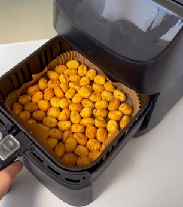

1. In a bowl, add the gnocchi, spices, salt, and oil, and mix well.
2. Place the gnocchi in the air fryer.
3. Set the air fryer to 180-200°C (350-400°F) for 15-20 minutes.
4. Halfway through the cooking time, shake the gnocchi to ensure even cooking.

---

_From [Instagram @fussimonsi](https://www.instagram.com/reel/CrbZ2BOoclU/?utm_source=ig_web_copy_link&igsh=MzRlODBiNWFlZA==)._

