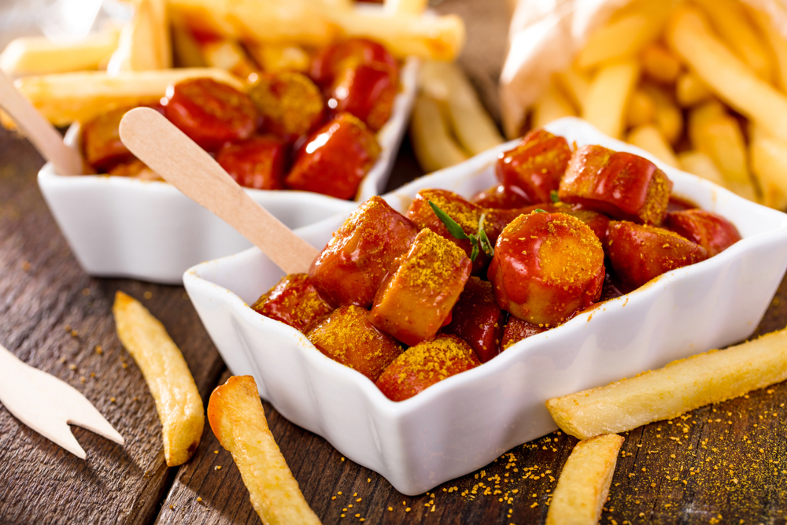

1. Cut the onion into thick julienne slices.
2. Sauté the onions in a pan until they are golden and soft.
3. Cook the sausages in a pan, on the grill, or in the oven until they are fully cooked.
4. For the sauce, combine all the ingredients in a pan and simmer until well-blended.
5. Slice the sausages into bite-sized pieces.
6. Assemble everything together, sprinkle curry powder over the sauce, and garnish with green chili peppers.

---

_Roughly similar to [Pretzel & Me](https://pretzelandme.blog/2022/04/19/original-german-currywurst/)._

