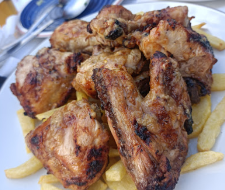

## For the Peri Peri sauce (optional)
- 1-4 peri peri chilies, or as many as you have (adjust the amount based on desired spiciness)
- 1 teaspoon brown sugar
- 3 garlic cloves
- 2 teaspoons sweet/spicy paprika
- Extra virgin olive oil
- A bit of fresh ginger
- Ground black pepper
- Salt
- Dried oregano
- 1 teaspoon soy sauce
- 40 ml white vinegar (or wine)
- 2 teaspoons lemon juice

## Instructions
1. **Prepare the chicken:** Clean the chicken and cut it into pieces (thighs, breasts, wings, etc.). You can also roast it whole if you prefer.
2. **Marinate the chicken:** Peel and crush the garlic cloves with olive oil, lemon juice, and salt, and rub the entire chicken with the mixture. Cover and leave it in the fridge for at least 1 hour (or preferably overnight in the fridge ~ 12 hours).
3. **Prepare the peri peri sauce (optional):** Blend all the piri piri sauce ingredients except for the oil (first remove the stems and seeds from the chilies). Once everything is well blended, add the necessary amount of olive oil, stirring well. Set aside.
4. **Cooking:** Preheat the oven to 200°C (390°F) and place the chicken in an oven-safe dish. Pour half a glass of water at the bottom and bake for 30 minutes. Flip the chicken halfway through cooking to ensure it cooks evenly. After this time, remove the chicken from the oven and coat it completely with the peri peri sauce. Turn on the grill and fully brown the chicken (ideally, finish it on a charcoal grill).

---

_From [Taberna Heliópolis](https://maps.app.goo.gl/3PA5jPJHGyjgPZQC6) and [Nando's](https://www.nandos.com/)_

_Similar recipes:_ 
- _[Directo al paladar](https://www.directoalpaladar.com/recetas-de-carnes-y-aves/receta-frango-piri-piri-pollo-al-carbon-asado-al-estilo-portugues)_
- _[20 minutos](https://www.20minutos.es/gastronomia/recetas/el-pueblo-de-portugal-conocido-como-la-capital-del-pollo-asi-es-su-receta-con-salsa-picante-5059820/)_
- _[El Comidista](https://elpais.com/gastronomia/recetas/2022/01/31/receta/1643623059_297177.html)_

