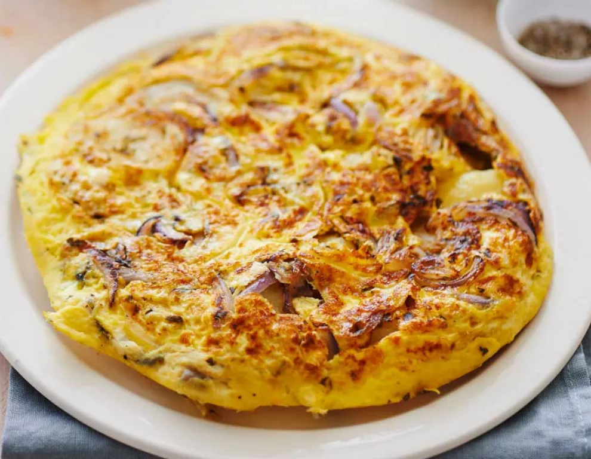

Ingredients for 2 servings.

1. Peel the onions and slice them thinly.
2. In a large pan, add a drizzle of oil, then the onions, cook them for about 10 minutes over medium heat, stirring occasionally until they soften (the onions should be translucent).
3. Beat the eggs in a bowl. Add the grated Parmesan, a pinch of salt, and a pinch of pepper, and mix well.
4. When the onions are completely softened, spread them evenly across the bottom of the pan. Then, add the beaten egg mixture, making sure it is distributed evenly. 
5. Cook the frittata for about 5-7 minutes over medium-low heat with the lid on.
6.  Flip the omelet and cook it on the other side for 4-5 minutes uncovered.

You can substitute Parmesan cheese with Grana Padano or Pecorino.

It can also be baked in the oven at 200°C (392°F) for about 20/25 minutes.

---

_From [SanPellegrino](https://www.sanpellegrino.com/sparkling-drinks/zesty-food/onion-frittata)._

