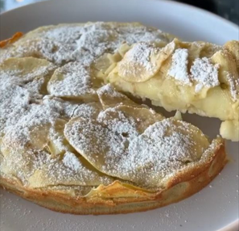

1. Peel the apples and slice them very thinly.
2. In a bowl, combine the flour, sugar, baking powder, oil, eggs, and milk. Mix until smooth.
3. Gently fold in the apple slices.
4. Grease and flour a baking pan, then pour the batter into the pan.
5. Bake at 180°C (350°F) until golden brown, about 30-40 minutes.
6. Once cooled, dust with powdered sugar or cinnamon for garnish.

---

_Adaptation from [Instagram @recetassaludables_sanas_](https://www.instagram.com/p/C6OTyuzg42l/?utm_source=ig_web_copy_link&igsh=MzRlODBiNWFlZA==)._

