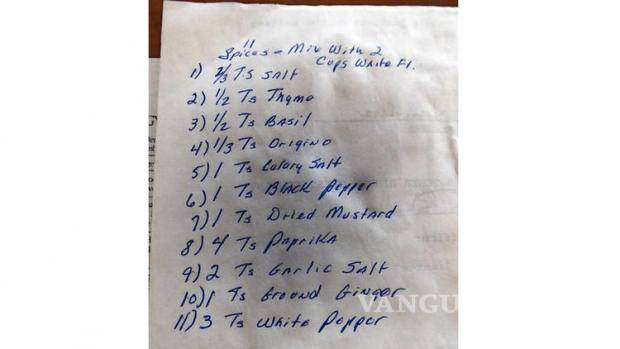
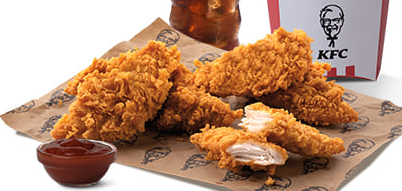

1. Cut the chicken breasts into medium-large cubes or strips and place them in a bowl.
2. Add the oil, yogurt, and spices. Stir and let marinate for 30 minutes.
3. Coat each piece in flour, then in beaten egg, and finally in crushed cornflakes (in that order).
4. Place them on a baking tray lined with baking paper and cook at 180°C (350°F) for 20 minutes, or in an Airfryer.
5. Serve with sauce.

## Original spice mix from KFC
- 2/3 tablespoon of salt

- 1/2 tablespoon of dried thyme
- 1/2 tablespoon of dried basil
- 1/3 tablespoon of dried oregano
- 1 tablespoon of celery salt
- 1 tablespoon of black pepper
- 1 tablespoon of mustard powder
- 4 tablespoons of paprika
- 2 tablespoons of garlic salt
- 1 tablespoon of ground ginger
- 3 tablespoons of white pepper

---

_Adaptation from [Instagram @titopezziafit](https://www.instagram.com/reel/C6UAgcQKITY/?utm_source=ig_web_copy_link&igsh=MzRlODBiNWFlZA==)._

