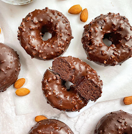

Quantities for 28 small donuts.

1. Blend all the ingredients.
  
2. Divide the mixture into a donut mold and bake at 180°C (350°F) for 18 minutes; or for 5 minutes in a donut maker.

3. (Optional) Let cool and decorate with melted dark chocolate mixed with almond pieces.

---

_From [Instagram @marisel.orozco](https://www.instagram.com/p/Ck8Z8h-DhS1/?igshid=MzRlODBiNWFlZA==)._

