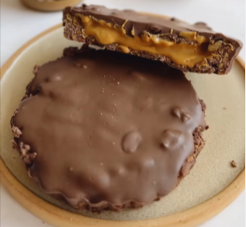

For 2 small tartlets.

1. Combine the cornflakes with the melted chocolate. 
2. Press the mixture firmly into two pre-greased mini tart molds to form the base. 
3. Chill in the fridge for 20 minutes.
4. Fill the tarts with peanut butter and sprinkle chopped walnuts on top.
5. Finally, cover with more melted chocolate (use as much as chocolate as needed).
6. Let them cool in the fridge.

---

_From [Instagram @levartenutricion](https://www.instagram.com/reel/C7982TBvhGE/?utm_source=ig_web_copy_link&igsh=MzRlODBiNWFlZA==)._

