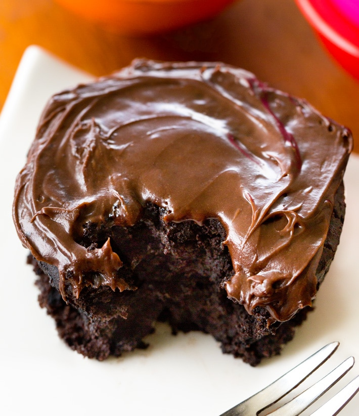

For 1 serving. 

## Tips
- If you use unsalted butter, add 1/8 teaspoon of salt.
- You can substitute the butter by oil (2-3 teaspoons) or mashed banana.
- If you want a larger portion, simply double the recipe and cook it in a medium-sized microwave-safe bowl, transforming this receipt in a **bowl cake**.

## Preparation
1.  In a microwave-safe mug, melt the butter in the microwave for about 20-30 seconds. 
2. Mix all the dry ingredients thoroughly until well combined.
3. Stir in the wet ingredients, ensuring the batter is smooth and lump-free.
4. Microwave the mixture on high for 60-90 seconds, depending on your microwave's wattage.
5. (Optional) Top with your favorite frosting or toppings as desired. 

---

_Adaptation from [Chocolate Covered Katie](https://chocolatecoveredkatie.com/chocolate-mug-cake-recipe/)._

