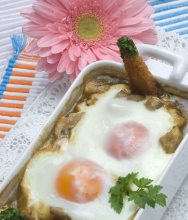

Ingredients for 2 servings.

1. Peel and chop the garlic cloves and sauté them in a pot with a drizzle of oil. 
2. Peel and chop the onion, add it to the pot, and let it soften. 
3. Season and add the dried chili peppers. 
4. Add the flour and cook it. 
5. Pour in the wine and add the cleaned and quartered mushrooms.
6. Season and cook for 12-15 minutes.
7. Remove the chili peppers and fill 2 oven-proof ramekins with the mushroom mixture. 
8. Make one or two wells in the center and crack an egg into each well. 
9. Bake (in a preheated oven) at 220°C (428°F) for 4-5 minutes.
10. Garnish with toasted sliced bread with spread butter and sprinkle with chopped parsley.

---

_From [Karlos Arguiñano](https://www.hogarmania.com/cocina/recetas/setas-hongos/champinones-salsa-huevo-3303.html)._

