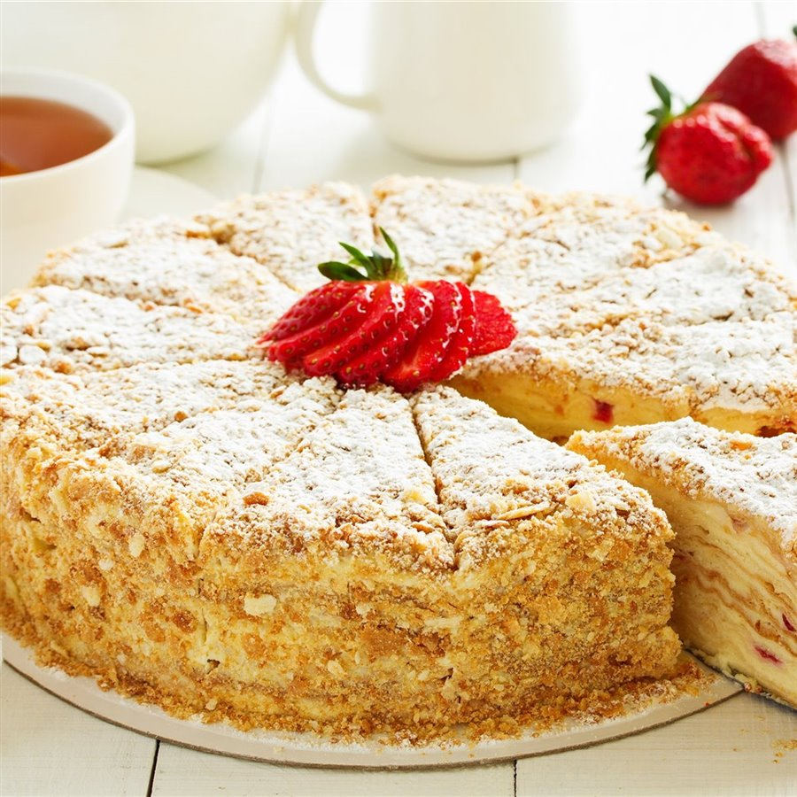

## For the cake layers
- 450 grams of flour
- 100 grams of sugar
- 25 grams of butter
- 3 eggs
- 1 teaspoon of baking powder
- A pinch of salt

## For the custard
- 700 ml of milk
- 2 eggs
- 100 grams of sugar
- 1 teaspoon of vanilla sugar
- 3 tablespoons of flour
- 100 grams of butter

## Preparation

### Prepare the cake dough
1. Beat the eggs with the sugar and a pinch of salt in a large bowl using a whisk. It's best to use an electric mixer, as you'll need to beat the eggs for 3 minutes until they double in volume. 
2. Add the butter and beat until fully incorporated. 
3. Add the baking powder and stir before adding the flour. 
4. Knead the mixture until you obtain a smooth dough.
5. Form the dough into a ball, wrap it in plastic wrap, and let it rest for 20 minutes in the bowl.

### Cook the custard
1. Mix the eggs in a saucepan with the sugar and flour. 
2. Stir until you get a creamy consistency. 
3. Add the milk and whisk until you get a light cream. 
4. Place the saucepan on low heat and stir with the whisk until the custard thickens. 
5. Cover it with plastic wrap and let it cool to room temperature. 
6. Beat 100 grams of butter for a couple of minutes, add 2 tablespoons of custard, stir, and then add the rest of the custard.

### Prepare the cake layers
1. Divide the dough into 9 parts and roll each one out into a disc shape. The cakes should be thin to ensure even cooking.
2. Cook the cake discs in a non-stick pan for 2 minutes on each side until golden brown. 
3. Once the discs are cooked, trim the edges using an upside-down bowl as a guide, so all the layers are the same size.
4. Use a food processor to crush all the cake trimmings into a fine crumb that will be used as the cake topping.

### Assemble the cake
1. Place one layer of cake on a large plate, and cover it with a couple of tablespoons of custard, spreading it over the entire surface. 
2. Repeat the process until the cake is assembled. 
3. Cover the entire cake with custard, spreading it over the surface and sides, and sprinkle the cake with the cake crumbs. 
4. Let it rest in the refrigerator for at least 6 hours, and it's ready to serve.

---

_From [CocinaFácil](https://www.lecturas.com/recetas/actualidad/tarta-napoleon-irresistible-receta-rusa-milhojas-bizcocho-sin-horno_11736)._

