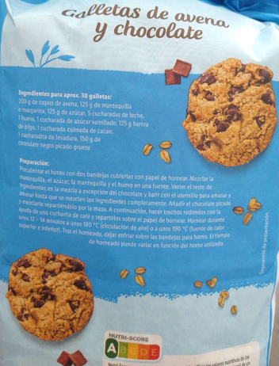

You can use wheat flour or any other kind of flour. I even recommend using ground oats as flour, in addition to the oat flakes.

1. Preheat the oven with two baking trays lined with parchment paper.
2. Mix the butter, sugar, and egg in a bowl.
3. Add the remaining ingredients to the mixture except for the chocolate, and mix with a dough utensil until fully combined.
4. Add the chopped chocolate and incorporate it evenly into the dough.
5. Then, use a coffee spoon to form small round portions and place them on the parchment paper. 
6. Bake for about 12-14 minutes at 180°C (356°F) (fan oven) or 190°C (374°F) (top and bottom heat).
7. After baking, let the cookies cool on the baking trays.
---

_From [Crownfield @Lidl](https://www.lidl.com/)._

