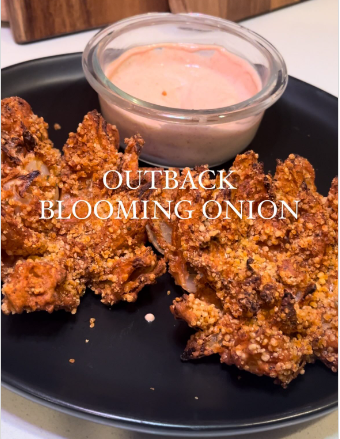

1. **Prepare the Onion:** Keep the root of the onion intact to hold it together. Slice off the top and peel the outer layer. Place the onion face down and cut it into quarters, then quarter it again once or twice more, depending on the size of the onion.
2. **Soak in ice water:** Let the cut onion sit in ice water for a few minutes. This helps the layers separate and gives the onion a crisp texture.
3. **Make the batter:** In a bowl, mix the flour, garlic powder, onion powder, paprika, oregano, salt, pepper, and water until a thick batter forms.
4. **Dry and dip the onion:** Remove the onion from the ice water and dry it thoroughly with a paper towel. Dip the onion into the batter, ensuring to coat every crevice carefully. Let any excess batter drip off.
5. **Coat with breadcrumbs:** Sprinkle breadcrumbs or panko over the onion until it’s fully coated.
6. **Air fry**: Place the coated onion in an air fryer, give it a light spray of olive oil, and cook at 180ºC (350°F) for 15 minutes, or until golden and crispy.

Serve with your favorite dipping sauce!

## Suggested dipping sauce
- 1/4 cup mayo
- 1/4 cup sour cream
- 2 tbsp ketchup
- 1 tbsp prepared horseradish
- 1 tsp worstchestire sauce
- 1 tsp garlic powder
- 1 tsp onion powder
- 1 tsp paprika
- 1 tsp paprika

---

_From [Instagram @alexrioscooks](https://www.instagram.com/reel/C6_9GM2v_U7/?utm_source=ig_web_copy_link&igsh=MzRlODBiNWFlZA==)._

