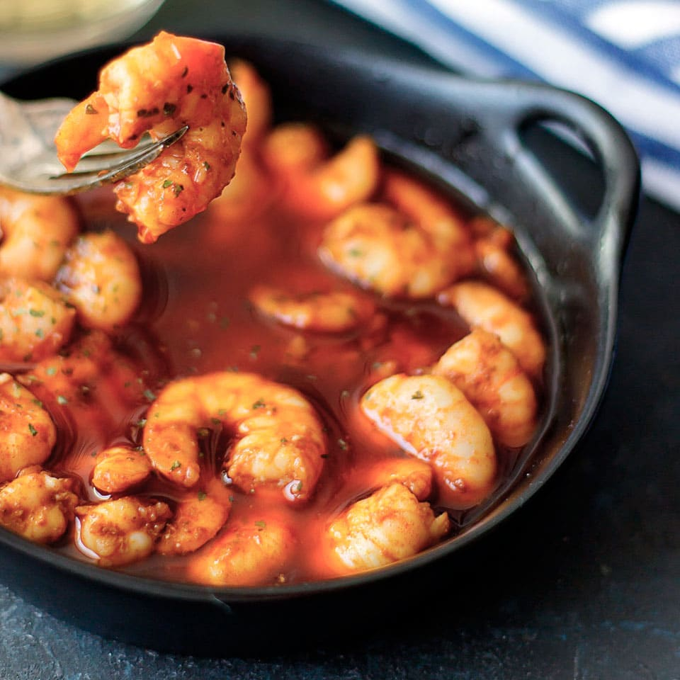

1. Peel the prawns or shrimp and set them aside.
2. Heat the oil over medium heat.
3. Peel the garlic cloves and slice them thinly.
4. Lower the heat and add the garlic and cayenne peppers, frying until the garlic is golden brown.
5. Remove the pan from the heat and add a teaspoon of paprika, stirring to prevent it from burning.
6. Add the prawns and let them cook in the residual heat.
7. If using shrimp, cook for an additional minute or two over the heat until they change color.
8. Transfer to small clay dishes and serve immediately.

---

_Adaptation from [Pequerecetas](https://www.pequerecetas.com/receta/gambas-al-pil-pil/)._

