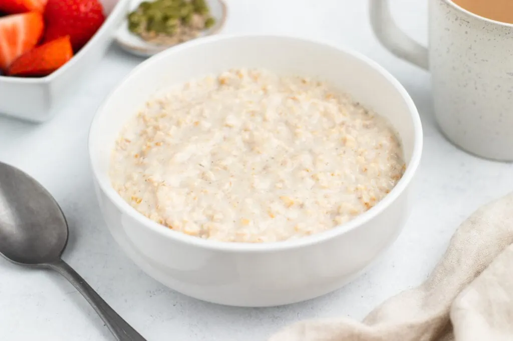

## To make on the hob
1. Add all ingredients to a large saucepan and stir together.
2. Bring to a simmer over a low-medium heat. 
3. Continue to simmer, stirring frequently, for another 5-7 minutes until the oats have softened and the porridge is creamy.

## To make in the microwave:
1. Add all ingredients to a microwave safe bowl and stir.
2. Microwave for 2 minutes, stir, then microwave for another 1 minute and 30 seconds.

Serve with your favourite toppings.

---

_From [Scottish Scran](https://scottishscran.com/how-to-make-porridge/)._

