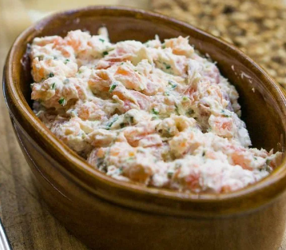

For 6 servings. 
You can also make the dish entirely with fresh salmon or entirely with smoked salmon by cooking half of it.

1. Season the salmon on both sides lightly with a bit of salt. Steam in a steamer basket until just cooked, about 8 minutes. Once cooked, remove from heat and let cool.
2. In a medium-sized bowl, mash together with a fork the butter and the olive oil until very smooth. This is important at this point. Otherwise, there'll be big chunks of butter in the finished rillettes.
3. Stir in the lemon juice, then the chopped chives and smoked salmon.
4. Remove the skin from the salmon and flake the cooked salmon over the mixture, then fold the pieces of salmon into the rillette mixture along with the chili powder. Taste, and add more salt if desired.
5. Scrape into a serving dish, cover, and chill for at least two hours. Let come to room temperature before serving.
---

It can be served with toasted slices of baguettes, but it would be tasty with dark rye or heaped on hearty.crackers.

## Storage
The rillettes can be made up to two days before and refrigerated.  
They can also be frozen, well-wrapped, for up to two months.

_From [David Lebovitz](https://www.davidlebovitz.com/salmon-rillette/)._

