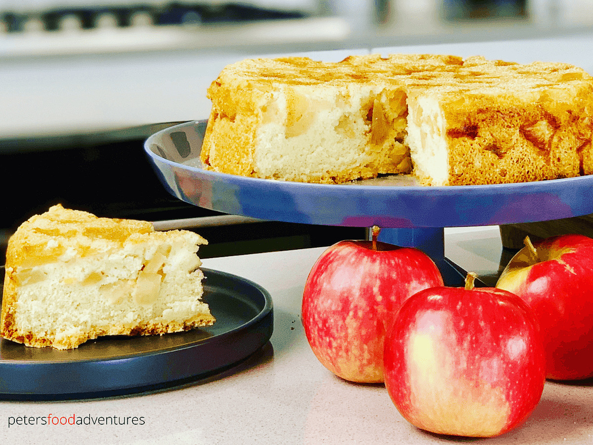

1. Preheat the oven to 350°F/180°C. Line a 9x3 round cake pan or springform pan with parchment paper. Butter or spray both the paper, and the sides of the pan.
2. Peel and core the apples. Chop in quarters, then slice into thin, bite size pieces.
3. Place the apples into the buttered cake pan.
4. Using a mixer, beat the eggs and sugar in a bowl until the sugar dissolves (around 5 minutes). Mix in the vanilla.
5. Gently add the flour and mix with a spoon until batter is thick and smooth.
6. Pour batter over the apples in the cake pan, spreading it evenly. Gently shake the pan to allow the batter to settle.
7. Bake in the oven at 180°C (350°F) for 40-50 minutes. Check cooking time at 40 minutes with a toothpick to see if cake is ready.
8. When cake is ready, allow to cool on a baking tray for 10 minutes.
9. Using a knife, run along sides of the cake pan. Carefully flip upside down. Peel off the parchment paper, revealing the apple base (now the top of your cake).
10. Sprinkle with cinnamon sugar to taste. Serve with thickened cream or vanilla ice cream.

---

_From [petersfoodadventures](https://petersfoodadventures.com/sharlotka/)._

