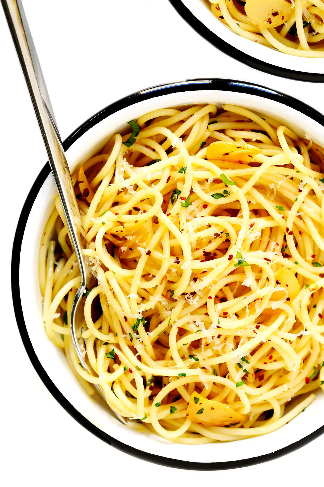

1. **Cook the spaghetti:** Bring a large stockpot of generously-salted water to a boil.  Add spaghetti and cook until nearly al dente (like, just one minute shy of being done).
2. **Sauté the garlic:**  Meanwhile, about 3 minutes after you add the pasta to the boiling water, heat the olive oil in a large sauté pan over medium heat.  Add the sliced garlic and crushed red pepper flakes and sauté for 3 to 5 minutes, or until it is lightly golden.  (It's very important that the garlic not burn.  So if the pasta is not ready to go by the time the garlic is lightly golden, remove the sauté pan from the heat until the pasta is ready.)
3. **Toss the pasta in the sauce:**  As soon as the pasta is ready to go, use tongs to transfer the pasta to the sauté pan, along with 1/2 cup of the hot starchy pasta water. Toss the pasta continuously until it is evenly coated in the garlic sauce. If the sauce looks a bit too dry, add in another 1/4 cup of the starchy pasta water. Taste and season. Give the pasta a quick taste add an extra pinch of salt and/or crushed red pepper flakes if needed.
4. **Serve:** Serve immediately while it's nice and hot, garnished with any toppings that sound good.

Optionally (in step 2), you can add anchovies, tuna, shrimps, dried tomatoes, etc.

---

_From [Gimme Some Oven](https://www.gimmesomeoven.com/spaghetti-aglio-e-olio/)._

