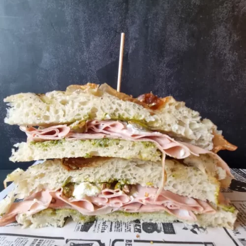

1. Toast the focaccia at 180°C (350°F) for 10-12 minutes (fan-assisted). Slice the focaccia in half horizontally (this can be done before or after toasting). 
2. Optionally, drizzle extra virgin olive oil on both halves.
3. Layer slices of mortadella on one half of the focaccia until it's fully covered.
4. Cut the burrata and spread it evenly over the mortadella.
5. Spread a layer of pesto on top of the burrata.
6. Close the focaccia with the other half. Serve by cutting it in half or into three pieces.

## Alternative filling:
- Fresh tomato
- Chicken deli meat
- Mozzarella cheese
- Guacamole
  
---

_Adaptation from [Pizza en Casa Pro](https://pizzaencasapro.com/receta/bocata-de-focaccia-rellena/)._

