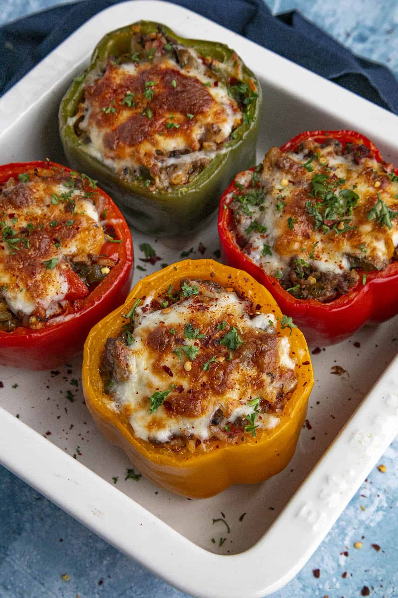

1. Preheat your oven to 220°C (425°F) and bring a pot of water (enough to cover the bell peppers) to a boil.
2. Wash the bell peppers, cut off the tops, and scoop out the insides. If needed, slice a small part off the bottom of the peppers so they will stand upright. (NOTE: Chop the extra bell pepper tops to cook later with the onion - discard the stem.)
3. Blanch the bell peppers for 5 minutes to slightly soften. (Alternative, you can roast the peppers for 20 minutes to soften).
4. Set the softened peppers into a lightly oiled baking dish.
5. Heat the oil in a large pan to medium heat and add the onions, chopped pepper tops, and jalapeno (if using). Cook for 5 minutes to soften.
6. Add the garlic and cook 1 minute, or until the garlic becomes fragrant.
7. Add the ground beef and cook 5-6 minutes, breaking apart as you go, until cooked through.
8. Add the fire roasted tomatoes, seasonings, and cooked rice. Stir together and remove from heat.
9.  Stir in half of the shredded cheese until incorporated.
10. Stuff each pepper with the meat filling mixture, then top each with the remaining shredded cheese.
11. Roast the stuffed peppers for 15-20 minutes, or until the peppers are tender to your preference, and the cheese is nice and bubbly.
12. Cool slightly, garnish, and serve.

---

_Adaptation from [Chili Pepper Madness](https://www.chilipeppermadness.com/recipes/stuffed-peppers/)._

