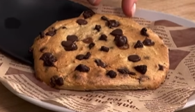

1. **Mix Ingredients:** In a bowl, mash the banana until smooth. Add the egg, oat flour, vanilla extract, and cocoa powder. Stir until you have a smooth, thick batter.

2. **Shape the Cookie:** Form a large cookie shape with the batter, or divide it into smaller portions if you prefer multiple cookies. Place parchment paper in the air fryer basket to prevent sticking.

3. **Cook in the Air Fryer:** Preheat the air fryer to 180°C (350°F). Place the cookie in the basket and cook for 8 minutes.

4. **Cool and Serve:** Let the cookie cool for a few minutes before serving. Enjoy warm!

---

_From [Instagram @cenasketo](https://www.instagram.com/reel/DA9ZrKsOhGO/?utm_source=ig_web_copy_link&igsh=MzRlODBiNWFlZA==)._

