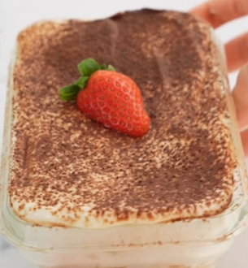

1. **Prepare the Sponge Cake:** In a bowl, mix the egg, yogurt, oat flour, baking powder, and sweetener until smooth.
Lightly grease a small microwave-safe dish or mug and pour in the batter.
Microwave on high for 3 minutes, checking after 2 minutes and adding 15-second intervals if needed until cooked.
Let the sponge cake cool for a few minutes, then slice it into thin layers.

1. **Soak the Layers:** Dip each sponge layer in cooled coffee, letting it absorb slightly without getting too soggy.

2. **Assemble the Tiramisu:** In a serving dish or individual cups, layer the coffee-soaked sponge cake and the cheese/yogurt cream alternately.
Continue layering until you run out of ingredients, finishing with a layer of cream on top.

1. **Decorate:** Dust cocoa powder over the top layer for a classic tiramisu finish.

2. **Chill:** Refrigerate for at least 1 hour before serving to allow the flavors to meld.

---

_Adaptation from [Instagram @annappleaday_](https://www.instagram.com/reel/CompRAejeHl/?utm_source=ig_web_copy_link&igsh=MzRlODBiNWFlZA==)._

