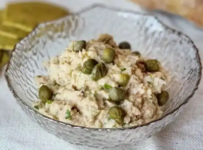

1. Drain the oil or water from the canned tuna using a strainer. Mash the tuna with a fork until it starts to form a paste.
2. Peel and finely chop the shallot into very small pieces, almost unnoticeable. Finely chop the capers (optional) and parsley as well.
3. In a bowl, mix the tuna with the lemon juice. Add the shallot, capers, parsley, mayonnaise, ketchup, and mustard (optional). Adjust the seasoning with salt and pepper. Mash everything well with a fork until you achieve a creaminess and homogeneous paste.
4. Cover with plastic wrap, ensuring that the wrap is in direct contact with the mixture, and let it rest in the refrigerator for 2 hours.

Serve with crackers or toasted bread for spreading or dipping. 
It's also a fantastic option for filling sandwiches or serving with vegetable crudités.

_Adaptation from [Cocinillas @El Español](https://www.elespanol.com/cocinillas/recetas/aperitivos-y-entrantes/20210214/pate-atun-alcaparras-receta-aperitivo-facil-picotear/1002229827003_30.html) and [Recetas del Señor](https://recetasdecocina.elmundo.es/2022/12/pate-de-atun-receta-facil.html)._

