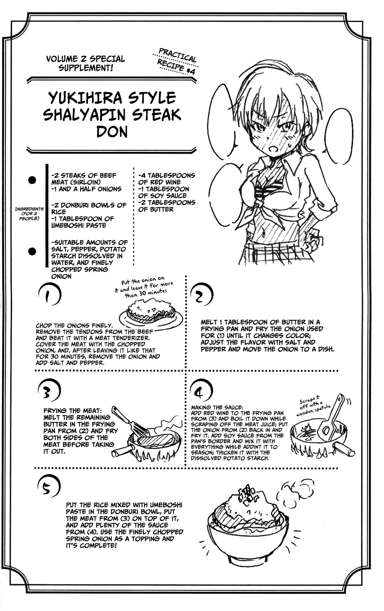

To prepare the rice bowl, follow the [Gohan receipt](recipe/gohan-rice/).

## How to cook
1. Chop the onions finely.

2. (Optional) Chop the garlic and mix with the onion.
3. Remove the tendons from the beef and beat it with a meat tenderizer until as flat as possible.
4. Cover meat on both sides with the chopped onion and leave for 30 minutes or more. 
5. Remove the onion and add salt and pepper to the steak.
the onion until it changes color.
7. Adjust the flavor with salt and pepper and move the onion to a dish.
8. Cook the steak to your preference (most would prefer medium-rare): Melt the ramining butter in the frying pan and fry both sides of the meat before taking it out.

## Making the sauce
1. Add red wine to the frying pan used for the beef to deglaze it. 
2. Boil down the wine while scraping off the meat juice with a wooden spatula.
3. Put the onion back in and fry it.
4. Add soy sauce from the pan's border and mix it with everything while adding it to season.
5. (Optional) Thicken it with the dissolved potato starch.

## Putting all together
1. Put rice in the donbury bowl.
2. (Optional) Mixe the rice with Umeboshi paste (pickled plum) in the donburi bowl. 
3. Place the beef on top and add plenty of sauce. 
4. Top with the finely chopped spring onion (chives).





---

_From [Shokugeki no Soma](https://shokugekinosoma.fandom.com/wiki/Chaliapin_Steak_Don)._

